```mermaid
flowchart TB
    subgraph current["AppHost.csproj"]
        MAIN["<b>📦&nbsp;AppHost.csproj</b><br/><small>net9.0</small>"]
        click MAIN "#apphostapphostcsproj"
    end
    subgraph downstream["Dependencies (2"]
        P7["<b>📦&nbsp;FinanceManager.Api.csproj</b><br/><small>net9.0</small>"]
        P9["<b>📦&nbsp;FinanceManager.WebUi.csproj</b><br/><small>net9.0</small>"]
        click P7 "#financemanagerapifinancemanagerapicsproj"
        click P9 "#financemanagerfinancemanagerwebuicsproj"
    end
    MAIN --> P7
    MAIN --> P9

```

```mermaid
flowchart TB
    subgraph upstream["Dependants (2)"]
        P3["<b>📦&nbsp;FinanceManager.Infrastructure.csproj</b><br/><small>net9.0</small>"]
        P5["<b>📦&nbsp;FinanceManager.UnitTests.csproj</b><br/><small>net9.0</small>"]
        click P3 "#financemanagerinfrastructurefinancemanagerinfrastructurecsproj"
        click P5 "#financemanagerunittestsfinancemanagerunittestscsproj"
    end
    subgraph current["FinanceManager.Application.csproj"]
        MAIN["<b>📦&nbsp;FinanceManager.Application.csproj</b><br/><small>net9.0</small>"]
        click MAIN "#financemanagerapplicationfinancemanagerapplicationcsproj"
    end
    subgraph downstream["Dependencies (1"]
        P2["<b>📦&nbsp;FinanceManager.Domain.csproj</b><br/><small>net9.0</small>"]
        click P2 "#financemanagerdomainfinancemanagerdomaincsproj"
    end
    P3 --> MAIN
    P5 --> MAIN
    MAIN --> P2

```

```mermaid
flowchart TB
    subgraph upstream["Dependants (2)"]
        P4["<b>📦&nbsp;FinanceManager.IntegrationTests.csproj</b><br/><small>net9.0</small>"]
        P9["<b>📦&nbsp;FinanceManager.WebUi.csproj</b><br/><small>net9.0</small>"]
        click P4 "#financemanagerintegrationtestsfinancemanagerintegrationtestscsproj"
        click P9 "#financemanagerfinancemanagerwebuicsproj"
    end
    subgraph current["FinanceManager.Components.csproj"]
        MAIN["<b>📦&nbsp;FinanceManager.Components.csproj</b><br/><small>net9.0</small>"]
        click MAIN "#financemanagercomponentsfinancemanagercomponentscsproj"
    end
    subgraph downstream["Dependencies (1"]
        P3["<b>📦&nbsp;FinanceManager.Infrastructure.csproj</b><br/><small>net9.0</small>"]
        click P3 "#financemanagerinfrastructurefinancemanagerinfrastructurecsproj"
    end
    P4 --> MAIN
    P9 --> MAIN
    MAIN --> P3

```

```mermaid
flowchart TB
    subgraph upstream["Dependants (1)"]
        P1["<b>📦&nbsp;FinanceManager.Application.csproj</b><br/><small>net9.0</small>"]
        click P1 "#financemanagerapplicationfinancemanagerapplicationcsproj"
    end
    subgraph current["FinanceManager.Domain.csproj"]
        MAIN["<b>📦&nbsp;FinanceManager.Domain.csproj</b><br/><small>net9.0</small>"]
        click MAIN "#financemanagerdomainfinancemanagerdomaincsproj"
    end
    P1 --> MAIN

```

```mermaid
flowchart TB
    subgraph upstream["Dependants (3)"]
        P5["<b>📦&nbsp;FinanceManager.UnitTests.csproj</b><br/><small>net9.0</small>"]
        P7["<b>📦&nbsp;FinanceManager.Api.csproj</b><br/><small>net9.0</small>"]
        P8["<b>📦&nbsp;FinanceManager.Components.csproj</b><br/><small>net9.0</small>"]
        click P5 "#financemanagerunittestsfinancemanagerunittestscsproj"
        click P7 "#financemanagerapifinancemanagerapicsproj"
        click P8 "#financemanagercomponentsfinancemanagercomponentscsproj"
    end
    subgraph current["FinanceManager.Infrastructure.csproj"]
        MAIN["<b>📦&nbsp;FinanceManager.Infrastructure.csproj</b><br/><small>net9.0</small>"]
        click MAIN "#financemanagerinfrastructurefinancemanagerinfrastructurecsproj"
    end
    subgraph downstream["Dependencies (1"]
        P1["<b>📦&nbsp;FinanceManager.Application.csproj</b><br/><small>net9.0</small>"]
        click P1 "#financemanagerapplicationfinancemanagerapplicationcsproj"
    end
    P5 --> MAIN
    P7 --> MAIN
    P8 --> MAIN
    MAIN --> P1

```

```mermaid
flowchart TB
    subgraph current["FinanceManager.IntegrationTests.csproj"]
        MAIN["<b>📦&nbsp;FinanceManager.IntegrationTests.csproj</b><br/><small>net9.0</small>"]
        click MAIN "#financemanagerintegrationtestsfinancemanagerintegrationtestscsproj"
    end
    subgraph downstream["Dependencies (2"]
        P7["<b>📦&nbsp;FinanceManager.Api.csproj</b><br/><small>net9.0</small>"]
        P8["<b>📦&nbsp;FinanceManager.Components.csproj</b><br/><small>net9.0</small>"]
        click P7 "#financemanagerapifinancemanagerapicsproj"
        click P8 "#financemanagercomponentsfinancemanagercomponentscsproj"
    end
    MAIN --> P7
    MAIN --> P8

```

```mermaid
flowchart TB
    subgraph current["FinanceManager.UnitTests.csproj"]
        MAIN["<b>📦&nbsp;FinanceManager.UnitTests.csproj</b><br/><small>net9.0</small>"]
        click MAIN "#financemanagerunittestsfinancemanagerunittestscsproj"
    end
    subgraph downstream["Dependencies (3"]
        P7["<b>📦&nbsp;FinanceManager.Api.csproj</b><br/><small>net9.0</small>"]
        P3["<b>📦&nbsp;FinanceManager.Infrastructure.csproj</b><br/><small>net9.0</small>"]
        P1["<b>📦&nbsp;FinanceManager.Application.csproj</b><br/><small>net9.0</small>"]
        click P7 "#financemanagerapifinancemanagerapicsproj"
        click P3 "#financemanagerinfrastructurefinancemanagerinfrastructurecsproj"
        click P1 "#financemanagerapplicationfinancemanagerapplicationcsproj"
    end
    MAIN --> P7
    MAIN --> P3
    MAIN --> P1

```

```mermaid
flowchart TB
    subgraph upstream["Dependants (1)"]
        P6["<b>📦&nbsp;AppHost.csproj</b><br/><small>net9.0</small>"]
        click P6 "#apphostapphostcsproj"
    end
    subgraph current["FinanceManager.WebUi.csproj"]
        MAIN["<b>📦&nbsp;FinanceManager.WebUi.csproj</b><br/><small>net9.0</small>"]
        click MAIN "#financemanagerfinancemanagerwebuicsproj"
    end
    subgraph downstream["Dependencies (1"]
        P8["<b>📦&nbsp;FinanceManager.Components.csproj</b><br/><small>net9.0</small>"]
        click P8 "#financemanagercomponentsfinancemanagercomponentscsproj"
    end
    P6 --> MAIN
    MAIN --> P8

```

```mermaid
flowchart TB
    subgraph upstream["Dependants (1)"]
        P7["<b>📦&nbsp;FinanceManager.Api.csproj</b><br/><small>net9.0</small>"]
        click P7 "#financemanagerapifinancemanagerapicsproj"
    end
    subgraph current["ServiceDefaults.csproj"]
        MAIN["<b>📦&nbsp;ServiceDefaults.csproj</b><br/><small>net9.0</small>"]
        click MAIN "#servicedefaultsservicedefaultscsproj"
    end
    P7 --> MAIN

```

# Projects and dependencies analysis

This document provides a comprehensive overview of the projects and their dependencies in the context of upgrading to .NETCoreApp,Version=v10.0.

## Table of Contents

- [Executive Summary](#executive-Summary)
  - [Highlevel Metrics](#highlevel-metrics)
  - [Projects Compatibility](#projects-compatibility)
  - [Package Compatibility](#package-compatibility)
  - [API Compatibility](#api-compatibility)
- [Aggregate NuGet packages details](#aggregate-nuget-packages-details)
- [Top API Migration Challenges](#top-api-migration-challenges)
  - [Technologies and Features](#technologies-and-features)
  - [Most Frequent API Issues](#most-frequent-api-issues)
- [Projects Relationship Graph](#projects-relationship-graph)
- [Project Details](#project-details)

  - [AppHost\AppHost.csproj](#apphostapphostcsproj)
  - [FinanceManager.Api\FinanceManager.Api.csproj](#financemanagerapifinancemanagerapicsproj)
  - [FinanceManager.Application\FinanceManager.Application.csproj](#financemanagerapplicationfinancemanagerapplicationcsproj)
  - [FinanceManager.Components\FinanceManager.Components.csproj](#financemanagercomponentsfinancemanagercomponentscsproj)
  - [FinanceManager.Domain\FinanceManager.Domain.csproj](#financemanagerdomainfinancemanagerdomaincsproj)
  - [FinanceManager.Infrastructure\FinanceManager.Infrastructure.csproj](#financemanagerinfrastructurefinancemanagerinfrastructurecsproj)
  - [FinanceManager.IntegrationTests\FinanceManager.IntegrationTests.csproj](#financemanagerintegrationtestsfinancemanagerintegrationtestscsproj)
  - [FinanceManager.UnitTests\FinanceManager.UnitTests.csproj](#financemanagerunittestsfinancemanagerunittestscsproj)
  - [FinanceManager\FinanceManager.WebUi.csproj](#financemanagerfinancemanagerwebuicsproj)
  - [ServiceDefaults\ServiceDefaults.csproj](#servicedefaultsservicedefaultscsproj)

## Executive Summary

### Highlevel Metrics

| Metric | Count | Status |
| :--- | :---: | :--- |
| Total Projects | 10 | All require upgrade |
| Total NuGet Packages | 44 | 12 need upgrade |
| Total Code Files | 337 |  |
| Total Code Files with Incidents | 82 |  |
| Total Lines of Code | 21260 |  |
| Total Number of Issues | 325 |  |
| Estimated LOC to modify | 303+ | at least 1.4% of codebase |

### Projects Compatibility

| Project | Target Framework | Difficulty | Package Issues | API Issues | Est. LOC Impact | Description |
| :--- | :---: | :---: | :---: | :---: | :---: | :--- |
| [AppHost\AppHost.csproj](#apphostapphostcsproj) | net9.0 | 🟢 Low | 1 | 0 |  | DotNetCoreApp, Sdk Style = True |
| [FinanceManager.Api\FinanceManager.Api.csproj](#financemanagerapifinancemanagerapicsproj) | net9.0 | 🟡 Medium | 2 | 46 | 46+ | AspNetCore, Sdk Style = True |
| [FinanceManager.Application\FinanceManager.Application.csproj](#financemanagerapplicationfinancemanagerapplicationcsproj) | net9.0 | 🟡 Medium | 1 | 37 | 37+ | ClassLibrary, Sdk Style = True |
| [FinanceManager.Components\FinanceManager.Components.csproj](#financemanagercomponentsfinancemanagercomponentscsproj) | net9.0 | 🟢 Low | 1 | 127 | 127+ | ClassLibrary, Sdk Style = True |
| [FinanceManager.Domain\FinanceManager.Domain.csproj](#financemanagerdomainfinancemanagerdomaincsproj) | net9.0 | 🟢 Low | 0 | 0 |  | ClassLibrary, Sdk Style = True |
| [FinanceManager.Infrastructure\FinanceManager.Infrastructure.csproj](#financemanagerinfrastructurefinancemanagerinfrastructurecsproj) | net9.0 | 🟢 Low | 4 | 25 | 25+ | ClassLibrary, Sdk Style = True |
| [FinanceManager.IntegrationTests\FinanceManager.IntegrationTests.csproj](#financemanagerintegrationtestsfinancemanagerintegrationtestscsproj) | net9.0 | 🟢 Low | 1 | 17 | 17+ | DotNetCoreApp, Sdk Style = True |
| [FinanceManager.UnitTests\FinanceManager.UnitTests.csproj](#financemanagerunittestsfinancemanagerunittestscsproj) | net9.0 | 🟡 Medium | 0 | 48 | 48+ | DotNetCoreApp, Sdk Style = True |
| [FinanceManager\FinanceManager.WebUi.csproj](#financemanagerfinancemanagerwebuicsproj) | net9.0 | 🟢 Low | 2 | 3 | 3+ | AspNetCore, Sdk Style = True |
| [ServiceDefaults\ServiceDefaults.csproj](#servicedefaultsservicedefaultscsproj) | net9.0 | 🟢 Low | 0 | 0 |  | ClassLibrary, Sdk Style = True |

### Package Compatibility

| Status | Count | Percentage |
| :--- | :---: | :---: |
| ✅ Compatible | 32 | 72.7% |
| ⚠️ Incompatible | 0 | 0.0% |
| 🔄 Upgrade Recommended | 12 | 27.3% |
| ***Total NuGet Packages*** | ***44*** | ***100%*** |

### API Compatibility

| Category | Count | Impact |
| :--- | :---: | :--- |
| 🔴 Binary Incompatible | 151 | High - Require code changes |
| 🟡 Source Incompatible | 17 | Medium - Needs re-compilation and potential conflicting API error fixing |
| 🔵 Behavioral change | 135 | Low - Behavioral changes that may require testing at runtime |
| ✅ Compatible | 60555 |  |
| ***Total APIs Analyzed*** | ***60858*** |  |

## Aggregate NuGet packages details

| Package | Current Version | Suggested Version | Projects | Description |
| :--- | :---: | :---: | :--- | :--- |
| Aspire.Hosting.AppHost | 13.0.2 | 13.1.0 | [AppHost.csproj](#apphostapphostcsproj) | NuGet package upgrade is recommended |
| Aspire.Hosting.PostgreSQL | 13.1.0 |  | [AppHost.csproj](#apphostapphostcsproj) | ✅Compatible |
| Blazor-ApexCharts | 6.0.2 |  | [FinanceManager.Components.csproj](#financemanagercomponentsfinancemanagercomponentscsproj) | ✅Compatible |
| Blazored.LocalStorage | 4.5.0 |  | [FinanceManager.Application.csproj](#financemanagerapplicationfinancemanagerapplicationcsproj) | ✅Compatible |
| Blazored.SessionStorage | 2.4.0 |  | [FinanceManager.Application.csproj](#financemanagerapplicationfinancemanagerapplicationcsproj) | ✅Compatible |
| coverlet.collector | 6.0.4 |  | [FinanceManager.IntegrationTests.csproj](#financemanagerintegrationtestsfinancemanagerintegrationtestscsproj) [FinanceManager.UnitTests.csproj](#financemanagerunittestsfinancemanagerunittestscsproj) | ✅Compatible |
| coverlet.msbuild | 6.0.4 |  | [FinanceManager.IntegrationTests.csproj](#financemanagerintegrationtestsfinancemanagerintegrationtestscsproj) [FinanceManager.UnitTests.csproj](#financemanagerunittestsfinancemanagerunittestscsproj) | ✅Compatible |
| CsvHelper | 33.1.0 |  | [FinanceManager.Components.csproj](#financemanagercomponentsfinancemanagercomponentscsproj) [FinanceManager.Infrastructure.csproj](#financemanagerinfrastructurefinancemanagerinfrastructurecsproj) | ✅Compatible |
| GitHubActionsTestLogger | 2.3.1 |  | [FinanceManager.UnitTests.csproj](#financemanagerunittestsfinancemanagerunittestscsproj) | ✅Compatible |
| Microsoft.AspNetCore.Authentication.JwtBearer | 9.0.10 | 10.0.1 | [FinanceManager.Api.csproj](#financemanagerapifinancemanagerapicsproj) | NuGet package upgrade is recommended |
| Microsoft.AspNetCore.Components.Authorization | 9.0.10 | 10.0.1 | [FinanceManager.Application.csproj](#financemanagerapplicationfinancemanagerapplicationcsproj) | NuGet package upgrade is recommended |
| Microsoft.AspNetCore.Components.Web | 9.0.10 | 10.0.1 | [FinanceManager.Components.csproj](#financemanagercomponentsfinancemanagercomponentscsproj) | NuGet package upgrade is recommended |
| Microsoft.AspNetCore.Components.WebAssembly | 9.0.10 | 10.0.1 | [FinanceManager.WebUi.csproj](#financemanagerfinancemanagerwebuicsproj) | NuGet package upgrade is recommended |
| Microsoft.AspNetCore.Components.WebAssembly.Authentication | 9.0.10 | 10.0.1 | [FinanceManager.WebUi.csproj](#financemanagerfinancemanagerwebuicsproj) | NuGet package upgrade is recommended |
| Microsoft.AspNetCore.Components.WebAssembly.DevServer | 10.0.1 |  | [FinanceManager.WebUi.csproj](#financemanagerfinancemanagerwebuicsproj) | ✅Compatible |
| Microsoft.AspNetCore.Mvc.Testing | 9.0.10 | 10.0.1 | [FinanceManager.IntegrationTests.csproj](#financemanagerintegrationtestsfinancemanagerintegrationtestscsproj) | NuGet package upgrade is recommended |
| Microsoft.AspNetCore.OpenApi | 9.0.10 | 10.0.1 | [FinanceManager.Api.csproj](#financemanagerapifinancemanagerapicsproj) | NuGet package upgrade is recommended |
| Microsoft.EntityFrameworkCore.Design | 9.0.10 | 10.0.1 | [FinanceManager.Infrastructure.csproj](#financemanagerinfrastructurefinancemanagerinfrastructurecsproj) | NuGet package upgrade is recommended |
| Microsoft.EntityFrameworkCore.InMemory | 9.0.10 | 10.0.1 | [FinanceManager.Infrastructure.csproj](#financemanagerinfrastructurefinancemanagerinfrastructurecsproj) | NuGet package upgrade is recommended |
| Microsoft.EntityFrameworkCore.SqlServer | 9.0.10 | 10.0.1 | [FinanceManager.Infrastructure.csproj](#financemanagerinfrastructurefinancemanagerinfrastructurecsproj) | NuGet package upgrade is recommended |
| Microsoft.EntityFrameworkCore.Tools | 9.0.10 | 10.0.1 | [FinanceManager.Infrastructure.csproj](#financemanagerinfrastructurefinancemanagerinfrastructurecsproj) | NuGet package upgrade is recommended |
| Microsoft.Extensions.Caching.Abstractions | 10.0.1 |  | [FinanceManager.Application.csproj](#financemanagerapplicationfinancemanagerapplicationcsproj) | ✅Compatible |
| Microsoft.Extensions.Configuration.Abstractions | 10.0.1 |  | [FinanceManager.Application.csproj](#financemanagerapplicationfinancemanagerapplicationcsproj) | ✅Compatible |
| Microsoft.Extensions.Configuration.Binder | 10.0.1 |  | [FinanceManager.Infrastructure.csproj](#financemanagerinfrastructurefinancemanagerinfrastructurecsproj) | ✅Compatible |
| Microsoft.Extensions.Configuration.EnvironmentVariables | 10.0.1 |  | [FinanceManager.Infrastructure.csproj](#financemanagerinfrastructurefinancemanagerinfrastructurecsproj) | ✅Compatible |
| Microsoft.Extensions.Configuration.Json | 10.0.1 |  | [FinanceManager.Infrastructure.csproj](#financemanagerinfrastructurefinancemanagerinfrastructurecsproj) | ✅Compatible |
| Microsoft.Extensions.DependencyInjection.Abstractions | 10.0.1 |  | [FinanceManager.Application.csproj](#financemanagerapplicationfinancemanagerapplicationcsproj) | ✅Compatible |
| Microsoft.Extensions.Hosting.Abstractions | 10.0.1 |  | [FinanceManager.Infrastructure.csproj](#financemanagerinfrastructurefinancemanagerinfrastructurecsproj) | ✅Compatible |
| Microsoft.Extensions.Http.Resilience | 10.1.0 |  | [ServiceDefaults.csproj](#servicedefaultsservicedefaultscsproj) | ✅Compatible |
| Microsoft.Extensions.ServiceDiscovery | 10.1.0 |  | [ServiceDefaults.csproj](#servicedefaultsservicedefaultscsproj) | ✅Compatible |
| Microsoft.NET.Test.Sdk | 18.0.1 |  | [FinanceManager.IntegrationTests.csproj](#financemanagerintegrationtestsfinancemanagerintegrationtestscsproj) [FinanceManager.UnitTests.csproj](#financemanagerunittestsfinancemanagerunittestscsproj) | ✅Compatible |
| Moq | 4.20.72 |  | [FinanceManager.IntegrationTests.csproj](#financemanagerintegrationtestsfinancemanagerintegrationtestscsproj) [FinanceManager.UnitTests.csproj](#financemanagerunittestsfinancemanagerunittestscsproj) | ✅Compatible |
| MudBlazor | 8.15.0 |  | [FinanceManager.Components.csproj](#financemanagercomponentsfinancemanagercomponentscsproj) | ✅Compatible |
| Newtonsoft.Json | 13.0.4 |  | [FinanceManager.Application.csproj](#financemanagerapplicationfinancemanagerapplicationcsproj) [FinanceManager.Components.csproj](#financemanagercomponentsfinancemanagercomponentscsproj) | ✅Compatible |
| Npgsql.EntityFrameworkCore.PostgreSQL | 9.0.0 |  | [FinanceManager.Infrastructure.csproj](#financemanagerinfrastructurefinancemanagerinfrastructurecsproj) | ✅Compatible |
| OpenTelemetry.Exporter.OpenTelemetryProtocol | 1.14.0 |  | [ServiceDefaults.csproj](#servicedefaultsservicedefaultscsproj) | ✅Compatible |
| OpenTelemetry.Extensions.Hosting | 1.14.0 |  | [ServiceDefaults.csproj](#servicedefaultsservicedefaultscsproj) | ✅Compatible |
| OpenTelemetry.Instrumentation.AspNetCore | 1.14.0 |  | [ServiceDefaults.csproj](#servicedefaultsservicedefaultscsproj) | ✅Compatible |
| OpenTelemetry.Instrumentation.Http | 1.14.0 |  | [ServiceDefaults.csproj](#servicedefaultsservicedefaultscsproj) | ✅Compatible |
| OpenTelemetry.Instrumentation.Runtime | 1.14.0 |  | [ServiceDefaults.csproj](#servicedefaultsservicedefaultscsproj) | ✅Compatible |
| Scalar.AspNetCore | 2.11.5 |  | [FinanceManager.Api.csproj](#financemanagerapifinancemanagerapicsproj) | ✅Compatible |
| System.Linq.Async | 7.0.0 |  | [FinanceManager.Application.csproj](#financemanagerapplicationfinancemanagerapplicationcsproj) | ✅Compatible |
| xunit.runner.visualstudio | 3.1.5 |  | [FinanceManager.IntegrationTests.csproj](#financemanagerintegrationtestsfinancemanagerintegrationtestscsproj) [FinanceManager.UnitTests.csproj](#financemanagerunittestsfinancemanagerunittestscsproj) | ✅Compatible |
| xunit.v3 | 3.2.1 |  | [FinanceManager.IntegrationTests.csproj](#financemanagerintegrationtestsfinancemanagerintegrationtestscsproj) [FinanceManager.UnitTests.csproj](#financemanagerunittestsfinancemanagerunittestscsproj) | ✅Compatible |

## Top API Migration Challenges

### Technologies and Features

| Technology | Issues | Percentage | Migration Path |
| :--- | :---: | :---: | :--- |
| IdentityModel & Claims-based Security | 5 | 1.7% | Windows Identity Foundation (WIF), SAML, and claims-based authentication APIs that have been replaced by modern identity libraries. WIF was the original identity framework for .NET Framework. Migrate to Microsoft.IdentityModel.* packages (modern identity stack). |

### Most Frequent API Issues

| API | Count | Percentage | Category |
| :--- | :---: | :---: | :--- |
| T:System.Linq.AsyncEnumerable | 142 | 46.9% | Binary Incompatible |
| T:System.Uri | 102 | 33.7% | Behavioral Change |
| T:System.Net.Http.HttpContent | 30 | 9.9% | Behavioral Change |
| M:System.TimeSpan.FromDays(System.Int32) | 5 | 1.7% | Source Incompatible |
| T:Microsoft.AspNetCore.Authentication.JwtBearer.JwtBearerDefaults | 3 | 1.0% | Source Incompatible |
| F:Microsoft.AspNetCore.Authentication.JwtBearer.JwtBearerDefaults.AuthenticationScheme | 3 | 1.0% | Source Incompatible |
| M:System.Uri.#ctor(System.String) | 3 | 1.0% | Behavioral Change |
| M:Microsoft.Extensions.Configuration.ConfigurationBinder.GetValue''1(Microsoft.Extensions.Configuration.IConfiguration,System.String) | 2 | 0.7% | Binary Incompatible |
| M:System.IdentityModel.Tokens.Jwt.JwtSecurityTokenHandler.WriteToken(Microsoft.IdentityModel.Tokens.SecurityToken) | 1 | 0.3% | Binary Incompatible |
| M:System.IdentityModel.Tokens.Jwt.JwtSecurityTokenHandler.CreateToken(Microsoft.IdentityModel.Tokens.SecurityTokenDescriptor) | 1 | 0.3% | Binary Incompatible |
| T:System.IdentityModel.Tokens.Jwt.JwtSecurityTokenHandler | 1 | 0.3% | Binary Incompatible |
| M:System.IdentityModel.Tokens.Jwt.JwtSecurityTokenHandler.#ctor | 1 | 0.3% | Binary Incompatible |
| T:System.IdentityModel.Tokens.Jwt.JwtRegisteredClaimNames | 1 | 0.3% | Binary Incompatible |
| P:Microsoft.AspNetCore.Authentication.JwtBearer.JwtBearerOptions.TokenValidationParameters | 1 | 0.3% | Source Incompatible |
| P:Microsoft.AspNetCore.Authentication.JwtBearer.JwtBearerOptions.SaveToken | 1 | 0.3% | Source Incompatible |
| P:Microsoft.AspNetCore.Authentication.JwtBearer.JwtBearerOptions.RequireHttpsMetadata | 1 | 0.3% | Source Incompatible |
| T:Microsoft.Extensions.DependencyInjection.JwtBearerExtensions | 1 | 0.3% | Source Incompatible |
| M:Microsoft.Extensions.DependencyInjection.JwtBearerExtensions.AddJwtBearer(Microsoft.AspNetCore.Authentication.AuthenticationBuilder,System.Action{Microsoft.AspNetCore.Authentication.JwtBearer.JwtBearerOptions}) | 1 | 0.3% | Source Incompatible |
| M:Microsoft.Extensions.DependencyInjection.OptionsConfigurationServiceCollectionExtensions.Configure''1(Microsoft.Extensions.DependencyInjection.IServiceCollection,Microsoft.Extensions.Configuration.IConfiguration) | 1 | 0.3% | Binary Incompatible |
| M:System.TimeSpan.FromMinutes(System.Int64) | 1 | 0.3% | Source Incompatible |
| M:System.Linq.AsyncEnumerable.Range(System.Int32,System.Int32) | 1 | 0.3% | Binary Incompatible |

## Projects Relationship Graph

Legend:
📦 SDK-style project
⚙️ Classic project

```mermaid
flowchart LR
    P1["<b>📦&nbsp;FinanceManager.Application.csproj</b><br/><small>net9.0</small>"]
    P2["<b>📦&nbsp;FinanceManager.Domain.csproj</b><br/><small>net9.0</small>"]
    P3["<b>📦&nbsp;FinanceManager.Infrastructure.csproj</b><br/><small>net9.0</small>"]
    P4["<b>📦&nbsp;FinanceManager.IntegrationTests.csproj</b><br/><small>net9.0</small>"]
    P5["<b>📦&nbsp;FinanceManager.UnitTests.csproj</b><br/><small>net9.0</small>"]
    P6["<b>📦&nbsp;AppHost.csproj</b><br/><small>net9.0</small>"]
    P7["<b>📦&nbsp;FinanceManager.Api.csproj</b><br/><small>net9.0</small>"]
    P8["<b>📦&nbsp;FinanceManager.Components.csproj</b><br/><small>net9.0</small>"]
    P9["<b>📦&nbsp;FinanceManager.WebUi.csproj</b><br/><small>net9.0</small>"]
    P10["<b>📦&nbsp;ServiceDefaults.csproj</b><br/><small>net9.0</small>"]
    P1 --> P2
    P3 --> P1
    P4 --> P7
    P4 --> P8
    P5 --> P7
    P5 --> P3
    P5 --> P1
    P6 --> P7
    P6 --> P9
    P7 --> P3
    P7 --> P10
    P8 --> P3
    P9 --> P8
    click P1 "#financemanagerapplicationfinancemanagerapplicationcsproj"
    click P2 "#financemanagerdomainfinancemanagerdomaincsproj"
    click P3 "#financemanagerinfrastructurefinancemanagerinfrastructurecsproj"
    click P4 "#financemanagerintegrationtestsfinancemanagerintegrationtestscsproj"
    click P5 "#financemanagerunittestsfinancemanagerunittestscsproj"
    click P6 "#apphostapphostcsproj"
    click P7 "#financemanagerapifinancemanagerapicsproj"
    click P8 "#financemanagercomponentsfinancemanagercomponentscsproj"
    click P9 "#financemanagerfinancemanagerwebuicsproj"
    click P10 "#servicedefaultsservicedefaultscsproj"

```

## Project Details

### AppHost\AppHost.csproj

#### Project Info

- **Current Target Framework:** net9.0
- **Proposed Target Framework:** net10.0
- **SDK-style**: True
- **Project Kind:** DotNetCoreApp
- **Dependencies**: 2
- **Dependants**: 0
- **Number of Files**: 1
- **Number of Files with Incidents**: 1
- **Lines of Code**: 12
- **Estimated LOC to modify**: 0+ (at least 0.0% of the project)

#### Dependency Graph

Legend:
📦 SDK-style project
⚙️ Classic project

### API Compatibility

| Category | Count | Impact |
| :--- | :---: | :--- |
| 🔴 Binary Incompatible | 0 | High - Require code changes |
| 🟡 Source Incompatible | 0 | Medium - Needs re-compilation and potential conflicting API error fixing |
| 🔵 Behavioral change | 0 | Low - Behavioral changes that may require testing at runtime |
| ✅ Compatible | 44 |  |
| ***Total APIs Analyzed*** | ***44*** |  |

### FinanceManager.Api\FinanceManager.Api.csproj

#### Project Info

- **Current Target Framework:** net9.0
- **Proposed Target Framework:** net10.0
- **SDK-style**: True
- **Project Kind:** AspNetCore
- **Dependencies**: 2
- **Dependants**: 3
- **Number of Files**: 29
- **Number of Files with Incidents**: 12
- **Lines of Code**: 2768
- **Estimated LOC to modify**: 46+ (at least 1.7% of the project)

#### Dependency Graph

Legend:
📦 SDK-style project
⚙️ Classic project

### API Compatibility

| Category | Count | Impact |
| :--- | :---: | :--- |
| 🔴 Binary Incompatible | 35 | High - Require code changes |
| 🟡 Source Incompatible | 11 | Medium - Needs re-compilation and potential conflicting API error fixing |
| 🔵 Behavioral change | 0 | Low - Behavioral changes that may require testing at runtime |
| ✅ Compatible | 4499 |  |
| ***Total APIs Analyzed*** | ***4545*** |  |

#### Project Technologies and Features

| Technology | Issues | Percentage | Migration Path |
| :--- | :---: | :---: | :--- |
| IdentityModel & Claims-based Security | 5 | 10.9% | Windows Identity Foundation (WIF), SAML, and claims-based authentication APIs that have been replaced by modern identity libraries. WIF was the original identity framework for .NET Framework. Migrate to Microsoft.IdentityModel.* packages (modern identity stack). |

### FinanceManager.Application\FinanceManager.Application.csproj

#### Project Info

- **Current Target Framework:** net9.0
- **Proposed Target Framework:** net10.0
- **SDK-style**: True
- **Project Kind:** ClassLibrary
- **Dependencies**: 1
- **Dependants**: 2
- **Number of Files**: 50
- **Number of Files with Incidents**: 13
- **Lines of Code**: 1628
- **Estimated LOC to modify**: 37+ (at least 2.3% of the project)

#### Dependency Graph

Legend:
📦 SDK-style project
⚙️ Classic project

### API Compatibility

| Category | Count | Impact |
| :--- | :---: | :--- |
| 🔴 Binary Incompatible | 32 | High - Require code changes |
| 🟡 Source Incompatible | 4 | Medium - Needs re-compilation and potential conflicting API error fixing |
| 🔵 Behavioral change | 1 | Low - Behavioral changes that may require testing at runtime |
| ✅ Compatible | 2686 |  |
| ***Total APIs Analyzed*** | ***2723*** |  |

### FinanceManager.Components\FinanceManager.Components.csproj

#### Project Info

- **Current Target Framework:** net9.0
- **Proposed Target Framework:** net10.0
- **SDK-style**: True
- **Project Kind:** ClassLibrary
- **Dependencies**: 1
- **Dependants**: 2
- **Number of Files**: 106
- **Number of Files with Incidents**: 24
- **Lines of Code**: 5192
- **Estimated LOC to modify**: 127+ (at least 2.4% of the project)

#### Dependency Graph

Legend:
📦 SDK-style project
⚙️ Classic project

### API Compatibility

| Category | Count | Impact |
| :--- | :---: | :--- |
| 🔴 Binary Incompatible | 4 | High - Require code changes |
| 🟡 Source Incompatible | 1 | Medium - Needs re-compilation and potential conflicting API error fixing |
| 🔵 Behavioral change | 122 | Low - Behavioral changes that may require testing at runtime |
| ✅ Compatible | 23559 |  |
| ***Total APIs Analyzed*** | ***23686*** |  |

### FinanceManager.Domain\FinanceManager.Domain.csproj

#### Project Info

- **Current Target Framework:** net9.0
- **Proposed Target Framework:** net10.0
- **SDK-style**: True
- **Project Kind:** ClassLibrary
- **Dependencies**: 0
- **Dependants**: 1
- **Number of Files**: 76
- **Number of Files with Incidents**: 1
- **Lines of Code**: 1719
- **Estimated LOC to modify**: 0+ (at least 0.0% of the project)

#### Dependency Graph

Legend:
📦 SDK-style project
⚙️ Classic project

### API Compatibility

| Category | Count | Impact |
| :--- | :---: | :--- |
| 🔴 Binary Incompatible | 0 | High - Require code changes |
| 🟡 Source Incompatible | 0 | Medium - Needs re-compilation and potential conflicting API error fixing |
| 🔵 Behavioral change | 0 | Low - Behavioral changes that may require testing at runtime |
| ✅ Compatible | 2440 |  |
| ***Total APIs Analyzed*** | ***2440*** |  |

### FinanceManager.Infrastructure\FinanceManager.Infrastructure.csproj

#### Project Info

- **Current Target Framework:** net9.0
- **Proposed Target Framework:** net10.0
- **SDK-style**: True
- **Project Kind:** ClassLibrary
- **Dependencies**: 1
- **Dependants**: 3
- **Number of Files**: 56
- **Number of Files with Incidents**: 10
- **Lines of Code**: 2780
- **Estimated LOC to modify**: 25+ (at least 0.9% of the project)

#### Dependency Graph

Legend:
📦 SDK-style project
⚙️ Classic project

### API Compatibility

| Category | Count | Impact |
| :--- | :---: | :--- |
| 🔴 Binary Incompatible | 25 | High - Require code changes |
| 🟡 Source Incompatible | 0 | Medium - Needs re-compilation and potential conflicting API error fixing |
| 🔵 Behavioral change | 0 | Low - Behavioral changes that may require testing at runtime |
| ✅ Compatible | 4453 |  |
| ***Total APIs Analyzed*** | ***4478*** |  |

### FinanceManager.IntegrationTests\FinanceManager.IntegrationTests.csproj

#### Project Info

- **Current Target Framework:** net9.0
- **Proposed Target Framework:** net10.0
- **SDK-style**: True
- **Project Kind:** DotNetCoreApp
- **Dependencies**: 2
- **Dependants**: 0
- **Number of Files**: 26
- **Number of Files with Incidents**: 7
- **Lines of Code**: 3444
- **Estimated LOC to modify**: 17+ (at least 0.5% of the project)

#### Dependency Graph

Legend:
📦 SDK-style project
⚙️ Classic project

### API Compatibility

| Category | Count | Impact |
| :--- | :---: | :--- |
| 🔴 Binary Incompatible | 7 | High - Require code changes |
| 🟡 Source Incompatible | 1 | Medium - Needs re-compilation and potential conflicting API error fixing |
| 🔵 Behavioral change | 9 | Low - Behavioral changes that may require testing at runtime |
| ✅ Compatible | 6207 |  |
| ***Total APIs Analyzed*** | ***6224*** |  |

### FinanceManager.UnitTests\FinanceManager.UnitTests.csproj

#### Project Info

- **Current Target Framework:** net9.0
- **Proposed Target Framework:** net10.0
- **SDK-style**: True
- **Project Kind:** DotNetCoreApp
- **Dependencies**: 3
- **Dependants**: 0
- **Number of Files**: 21
- **Number of Files with Incidents**: 11
- **Lines of Code**: 2199
- **Estimated LOC to modify**: 48+ (at least 2.2% of the project)

#### Dependency Graph

Legend:
📦 SDK-style project
⚙️ Classic project

### API Compatibility

| Category | Count | Impact |
| :--- | :---: | :--- |
| 🔴 Binary Incompatible | 48 | High - Require code changes |
| 🟡 Source Incompatible | 0 | Medium - Needs re-compilation and potential conflicting API error fixing |
| 🔵 Behavioral change | 0 | Low - Behavioral changes that may require testing at runtime |
| ✅ Compatible | 5394 |  |
| ***Total APIs Analyzed*** | ***5442*** |  |

### FinanceManager\FinanceManager.WebUi.csproj

#### Project Info

- **Current Target Framework:** net9.0
- **Proposed Target Framework:** net10.0
- **SDK-style**: True
- **Project Kind:** AspNetCore
- **Dependencies**: 1
- **Dependants**: 1
- **Number of Files**: 67
- **Number of Files with Incidents**: 2
- **Lines of Code**: 1392
- **Estimated LOC to modify**: 3+ (at least 0.2% of the project)

#### Dependency Graph

Legend:
📦 SDK-style project
⚙️ Classic project

### API Compatibility

| Category | Count | Impact |
| :--- | :---: | :--- |
| 🔴 Binary Incompatible | 0 | High - Require code changes |
| 🟡 Source Incompatible | 0 | Medium - Needs re-compilation and potential conflicting API error fixing |
| 🔵 Behavioral change | 3 | Low - Behavioral changes that may require testing at runtime |
| ✅ Compatible | 11151 |  |
| ***Total APIs Analyzed*** | ***11154*** |  |

### ServiceDefaults\ServiceDefaults.csproj

#### Project Info

- **Current Target Framework:** net9.0
- **Proposed Target Framework:** net10.0
- **SDK-style**: True
- **Project Kind:** ClassLibrary
- **Dependencies**: 0
- **Dependants**: 1
- **Number of Files**: 1
- **Number of Files with Incidents**: 1
- **Lines of Code**: 126
- **Estimated LOC to modify**: 0+ (at least 0.0% of the project)

#### Dependency Graph

Legend:
📦 SDK-style project
⚙️ Classic project

### API Compatibility

| Category | Count | Impact |
| :--- | :---: | :--- |
| 🔴 Binary Incompatible | 0 | High - Require code changes |
| 🟡 Source Incompatible | 0 | Medium - Needs re-compilation and potential conflicting API error fixing |
| 🔵 Behavioral change | 0 | Low - Behavioral changes that may require testing at runtime |
| ✅ Compatible | 122 |  |
| ***Total APIs Analyzed*** | ***122*** |  |

