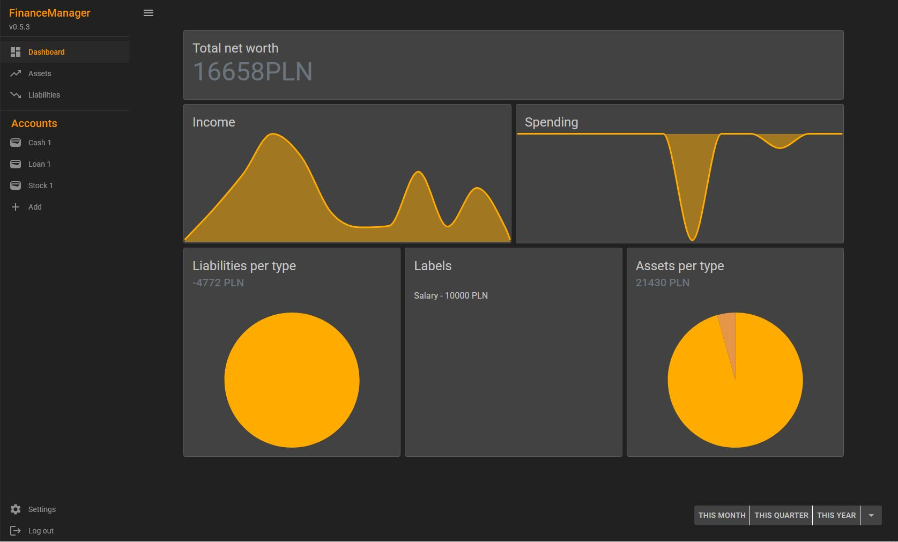
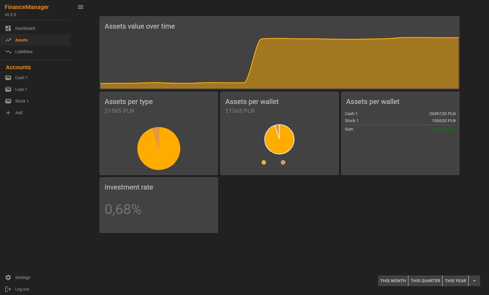
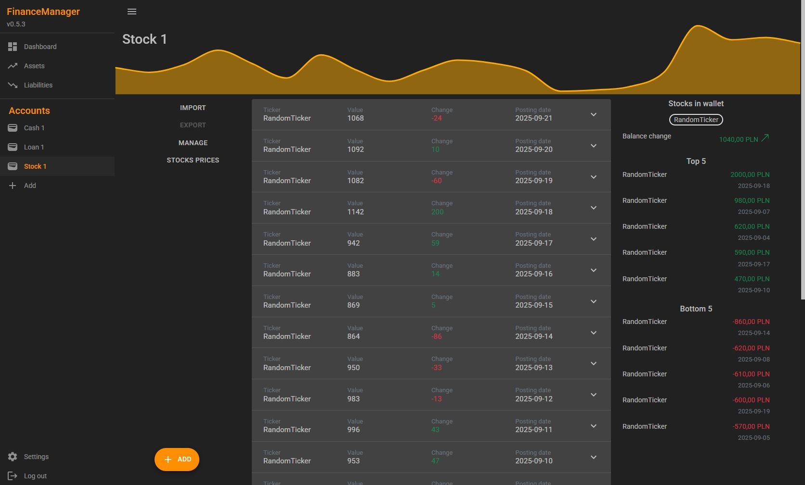

# FinanceManager

Finance manager is an online budgeting tool. This software lets you keep track of your

 - income,
 - spending,
 - investments

 Check out the [DEMO](https://avresial.github.io/FinanceManager/landingpage)!

## Intuitive dashboard design
### Keep it simple and gather your important data in one place.

## Assets
### Manage your assets like a real pro

## Accounts
### Track cash, shares, ETF, real estate value and more...

