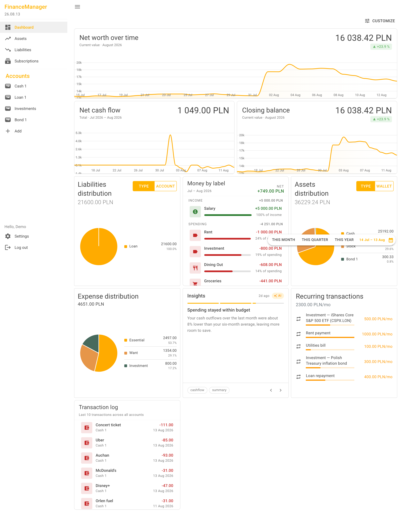
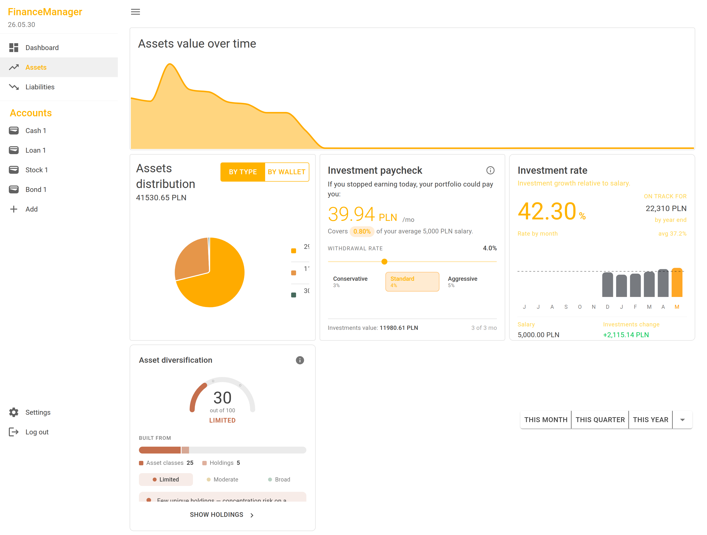
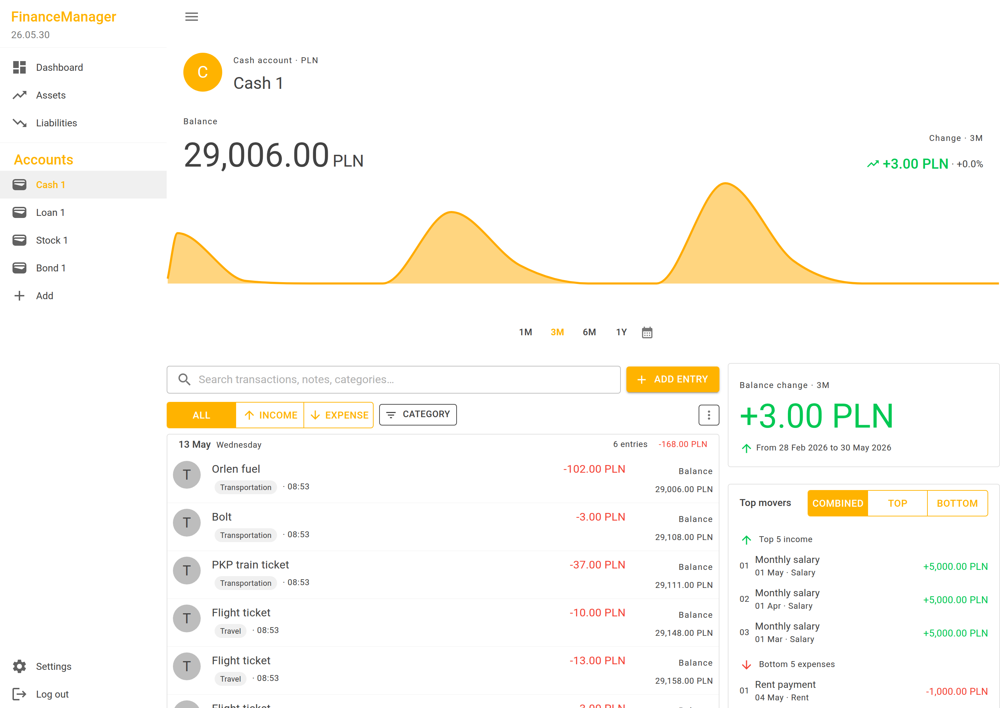

<p align="center">
  <a href="https://github.com/avresial/FinanceManager/stargazers"></a>
  <a href="https://github.com/avresial/FinanceManager/issues"></a>
  
  
  <a href="https://financemanager.mikikarkowski.dev/login"></a>
</p>

# FinanceManager

**FinanceManager** is an open-source personal finance tracker built with Blazor WebAssembly and ASP.NET Core. It lets you manage all your accounts — cash, stocks, and bonds — in one place, with a rich analytics dashboard, AI-powered insights, and real-time market data.

> **[Live App](https://financemanager.mikikarkowski.dev/login)**

---

## Screenshots

### Dashboard
Get a complete picture of your finances at a glance — net worth, cash flow, asset allocation, and AI-generated insights all in one place.



### Assets
View and manage all your financial accounts across multiple asset classes.



### Account Details
Drill into individual accounts to inspect transactions, trends, and performance metrics.



---

## Features

### Dashboard
The dashboard aggregates data across all your accounts and presents it through a collection of interactive cards:

- **Net Worth Overview** — total assets minus liabilities, updated in real time
- **Cash Flow** — income vs. outflow analysis with inflow/outflow breakdown
- **Asset Allocation** — breakdown by account and by investment type (cash, stock, bond, property, crypto, commodities)
- **Diversification Gauge** — visual proxy score showing how diversified your portfolio is
- **Investment Rate & Paycheck Estimator** — project passive income from your investment portfolio
- **Expense Distribution** — categorised spending breakdown
- **Recurring Transaction Detector** — automatically identifies repeating income or expense patterns
- **Financial Insights (AI)** — carousel of AI-generated observations and recommendations based on your data
- **Time Series Charts** — plot net worth, assets, liabilities, and investment types over any date range

### Financial Accounts
Three account types are fully supported, each with dedicated views:

| Account type | What it tracks |
|---|---|
| **Currency** | Cash balances and everyday transactions |
| **Stock** | Equity holdings with live price updates |
| **Bond** | Fixed-income securities, including inflation-linked bonds |

### Data Management
- **CSV Import / Export** — bring in transaction history from external sources; map custom CSV headers; resolve import conflicts
- **Bulk stock price import** — seed historical price data in one operation
- **Multi-account import** — import several accounts in a single workflow

### Real-Time Market Data
- Live stock prices via the **Alpha Vantage** API
- Live currency exchange rates
- Prices cached in the database to minimise external API calls

### AI-Powered Features
- **Financial Insights** — large-language-model analysis of your transaction history delivered as actionable cards
- **Automatic account labelling** — AI suggests category labels (Cash, Stock, Bond, Crypto, Loan, Real Estate, …) for new accounts
- Configurable **provider chain** with automatic fallback: OpenRouter → GitHub Models → Ollama / LM Studio (local)

### User & Admin
- JWT-based authentication with registration and login
- Role-based admin panel for managing users, AI provider configuration, stock catalogue, and bond data

---

## Tech Stack

| Layer | Technology |
|---|---|
| Frontend | Blazor WebAssembly, MudBlazor (Material Design), ApexCharts.js |
| Backend | ASP.NET Core 10, SignalR, Entity Framework Core |
| Database | PostgreSQL (SQL Server also supported) |
| AI / LLM | OpenRouter, GitHub Models, Ollama, LM Studio |
| Market data | Alpha Vantage API |
| Observability | OpenTelemetry (OTLP export) |
| Local orchestration | .NET Aspire |
| Testing | xUnit, Moq, WebApplicationFactory, Coverlet |

The solution follows a **layered modular monolith** architecture:

```
Blazor component → typed HttpClient → API controller → application service → domain service → repository
```

Key design decisions worth noting for reviewers:
- **Domain layer has zero infrastructure dependencies** — no EF Core or ASP.NET references inside `FinanceManager.Domain`
- **Typed HTTP clients** encapsulate all API route details; components never call `HttpClient` directly
- **Provider fallback chain** for AI and stock prices keeps the app functional when any single external service is unavailable
- **Background services + channels** handle async jobs (insight generation, label assignment, CSV import) without blocking the request pipeline
- **SignalR** pushes real-time progress updates to the browser during long-running imports

---

## Getting Started

### Prerequisites
- [.NET 10 SDK](https://dotnet.microsoft.com/download)
- PostgreSQL **or** SQL Server
- (Optional) [.NET Aspire workload](https://learn.microsoft.com/en-us/dotnet/aspire/fundamentals/setup-tooling) for one-command local orchestration

### Run with Aspire (recommended)
```bash
dotnet run --project code/AppHost
```
This starts a PostgreSQL container and the API automatically.

### Run manually
```bash
# Restore and build
dotnet restore ./code
dotnet build ./code/FinanceManager.slnx

# Apply database migrations
dotnet ef database update -s code/FinanceManager.Api/FinanceManager.Api.csproj

# Start the API (also serves the Blazor WASM client)
dotnet run --project code/FinanceManager.Api
```

Then open `https://localhost:5001` in your browser.

For production backup, restore, and rollback steps on Supabase, see [RUNBOOK.md](RUNBOOK.md).

### Run tests
```bash
# All tests
dotnet test ./code/FinanceManager.slnx

# Unit tests only
dotnet test ./code/FinanceManager.Tests.Unit/FinanceManager.Tests.Unit.csproj

# Integration tests (uses in-memory DB)
UseInMemoryDatabase=true dotnet test ./code/FinanceManager.Tests.Integration/FinanceManager.Tests.Integration.csproj
```

### External API keys (optional)
Supply these via environment variables or .NET User Secrets — never commit them:

| Variable | Service |
|---|---|
| `AlphaVantage__ApiKey` | Live stock prices |
| `OpenRouter__ApiKey` | OpenRouter LLM |
| `GitHubModels__Token` | GitHub Models LLM |

---

## Author

- **[avresial](https://github.com/avresial)**
