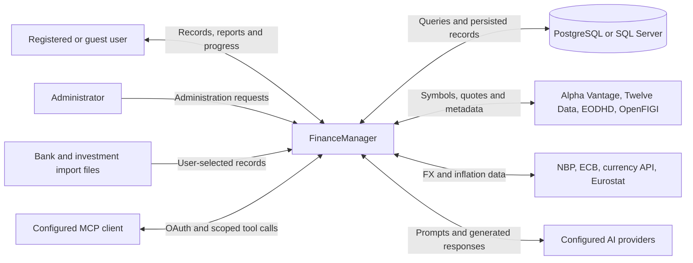
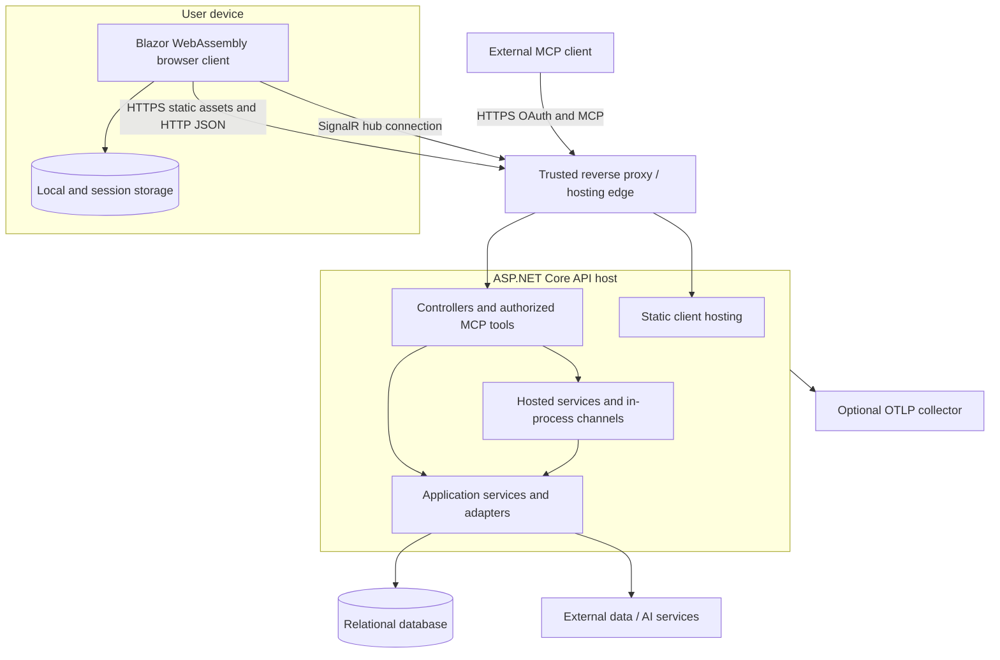

# 3. Context and scope

[Architecture index](README.md)

## 3.1 Business context

FinanceManager's boundary contains account/transaction management, analytics, generated insights, identity, administration, and the adapters necessary to deliver those features. User devices, import files, external data/AI services, and hosting infrastructure remain outside it. PostgreSQL or SQL Server provides persistent storage; its schemas and migrations are owned by FinanceManager even though the database is a separate deployment resource.

This diagram identifies relationships, not guaranteed provider order or production availability. [Infrastructure registrations](../../code/FinanceManager.Infrastructure/ServiceCollectionExtension.cs) establish concrete market/FX/inflation adapters. [AI registration](../../code/FinanceManager.Infrastructure/Shared/Ai/ServiceCollectionExtension.cs) and [fallback selection](../../code/FinanceManager.Infrastructure/Shared/Ai/FallbackChatClient.cs) establish the supported AI clients and configuration-defined order.

| Partner | Input to FinanceManager | Output from FinanceManager | Ownership / boundary concern |
|---|---|---|---|
| User | Account data, transactions, preferences, imports, credentials | Financial records and analyses, errors, progress | Authenticate and enforce account ownership; guest data follows a separate sandbox lifecycle |
| Administrator | Operational configuration and authorized administration requests | Logs, health, user/configuration state | Administration must retain role checks |
| Import files | Untrusted records and headers selected by the user | Preview, imported entries, conflict choices/results | Validate request size, shape, account owner, and conflict decisions |
| Market-data services | Daily/latest quotes and instrument mappings | Symbols, time ranges, configured credentials | Quotas, delayed data, differing symbols and quote units |
| Currency/inflation services | Historical/current rates and inflation indexes | Currency/date/range requests | Publication schedules, unsupported pairs, gaps, and unit consistency |
| AI providers | Generated text/structured responses | Feature prompts that can include financial context | Provider availability and financial-data exposure require intentional configuration; output is generated rather than deterministic calculation |
| MCP clients | OAuth authorization and tool calls | User-scoped account/transaction/investment/reference results | Use dedicated OAuth scope/resource validation, not ordinary browser JWT acceptance |

Provider-specific URLs, authentication/configuration keys, fallback behavior, and limits are maintained in [integrations](concepts/integrations.md).

## 3.2 Technical context

Browser static hosting, fallback routing, controllers, middleware, and hub routes are wired in [Program.cs](../../code/FinanceManager.Api/Program.cs). Browser services and an API-base `HttpClient` are wired in [WASM Program.cs](../../code/FinanceManager/Program.cs). The request pipeline trusts only configured forwarded proxy addresses/networks; committed configuration and CI describe an intended hosting topology, not live infrastructure verification. See [deployment](07-deployment-view.md).

| Interface | Transport / endpoint | Contract and access behavior |
|---|---|---|
| Browser assets / SPA routes | HTTP(S), static files and `index.html` fallback | API serves published WASM; PWA static asset caching is separate from financial-data freshness; [PWA guide](concepts/pwa.md) |
| Feature API | JSON under controller-specific `api/...` routes | [Feature HTTP clients](../../code/FinanceManager.Components/Features), [API controllers](../../code/FinanceManager.Api/Features), and shared DTOs in Domain/Application |
| Browser authentication | Login plus `/api/Auth/csrf-token`, `/api/Auth/refresh`, `/api/Auth/logout` | Bearer access JWT and rotating HttpOnly refresh cookie; antiforgery required for cookie-based refresh/logout |
| Import progress | SignalR `/hubs/currency-import` plus status HTTP endpoint | User-checked job group join; import status polling complements notifications |
| Label progress / admin logs | SignalR `/hubs/label-setter-progress`, `/hubs/admin-logs` | Hub-specific authorization; mapped and bearer query-token handling limited to these hub paths |
| MCP / OAuth | `/mcp`, discovery routes, `/connect/authorize`, `/connect/token` | Enabled only by configuration; separate MCP OAuth authorization policy; [runtime](06-runtime-view.md#65-oauth-authorized-mcp-tool-call) |
| Health / telemetry | `/alive`, `/health`, `/health/detail`, optional OTLP | Detailed health requires Admin; [ServiceDefaults](../../code/ServiceDefaults/Extensions.cs) |
| Persistence | EF Core SQL Server or Npgsql, plus guest/test InMemory contexts | Provider and connection selection at startup; [database configuration](02-architecture-constraints.md#23-configuration-and-runtime-constraints) |

## 3.3 Trust boundaries and exclusions

The browser and MCP caller are untrusted clients: route parameters, imported data, cached snapshots, and client-selected account ids cannot establish ownership. HTTP authentication identifies the caller; controllers/tools and repositories establish the allowed data scope. The authorized [currency import hub](../../code/FinanceManager.Api/Features/FinancialAccounts/Currencies/Hubs/CurrencyImportHub.cs) checks job ownership before joining a group. UI authorization and the passwordless develop-login page are not security boundaries; [the server's develop-login controller](../../code/FinanceManager.Api/Features/Identity/Controllers/DevelopLoginController.cs) rejects Production and Release environments.

API-to-provider calls cross external trust boundaries. Provider responses, generated AI output, and unavailable rates require explicit interpretation rather than treating a successful HTTP response as a verified financial result. Browser storage is a performance/session mechanism, not an authoritative financial ledger. [UI snapshots](concepts/ui-snapshots.md) always refresh a rendered snapshot and preserve context isolation.

This architecture does not describe a broker, bank settlement service, or order-execution platform. Recorded investment transactions and fetched market data support personal-finance reporting; no code evidence establishes trade execution. It also does not claim full offline financial operation, independently durable background queues, or a globally distributed cache. These limits inform [risks](11-risks-and-technical-debt.md).
