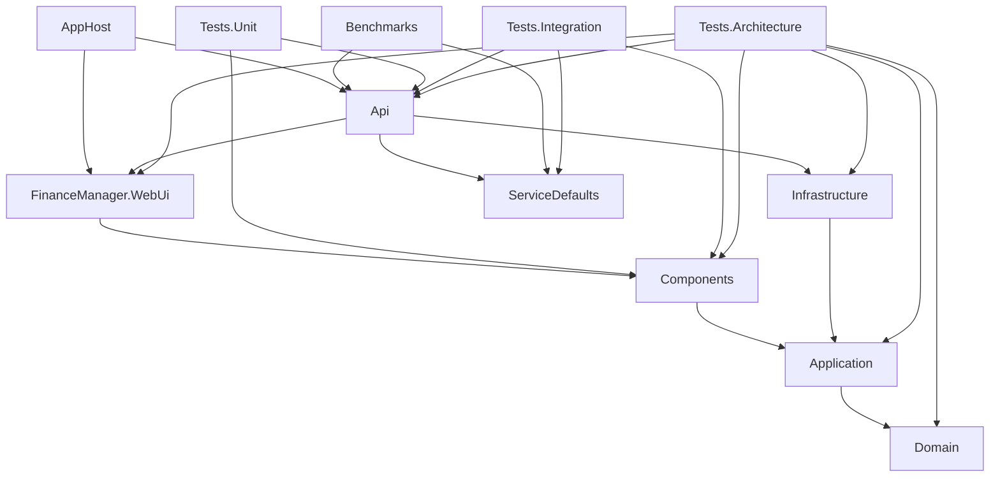

# 5. Building block view

[Architecture index](README.md)

## 5.1 Level 1: system and repository map

The deployable system consists of the API host and the browser assets it publishes. The host composes Application and Infrastructure; the browser composes Components and shared Application/Domain types. AppHost orchestrates local infrastructure rather than becoming a production business service.

| Block / path | Owns | Boundary and evidence |
|---|---|---|
| [FinanceManager](../../code/FinanceManager) / `FinanceManager.WebUi.csproj` | WASM root components, browser bootstrap, API-base client, browser storage/authorization registrations | [Program.cs](../../code/FinanceManager/Program.cs); no controller or persistence implementation |
| [FinanceManager.Components](../../code/FinanceManager.Components) | Feature pages/components, typed HTTP clients, browser services, caches/snapshots and interactive state | [ServiceCollectionExtension](../../code/FinanceManager.Components/ServiceCollectionExtension.cs); no API/Infrastructure project reference |
| [FinanceManager.Api](../../code/FinanceManager.Api) | HTTP controllers, middleware, bearer/OAuth setup, SignalR, hosted workers, EF migrations, static client hosting | [Program.cs](../../code/FinanceManager.Api/Program.cs); route/host and worker coordination rather than reusable financial calculations |
| [FinanceManager.Application](../../code/FinanceManager.Application) | Use-case services, valuation/performance, providers and fallback coordination, import/insight/label orchestration, seeders, shared browser services | [registrations](../../code/FinanceManager.Application/ServiceCollectionExtension.cs); no Infrastructure project dependency or direct EF context |
| [FinanceManager.Domain](../../code/FinanceManager.Domain) | Entities, repository and service contracts, DTOs, value/result types, commands and domain concepts | [project](../../code/FinanceManager.Domain/FinanceManager.Domain.csproj); no other project reference or ASP.NET/EF package reference |
| [FinanceManager.Infrastructure](../../code/FinanceManager.Infrastructure) | EF context/model/configurations, repositories and cache decorators, external market/FX/AI adapters, OAuth persistence support | [AppDbContext](../../code/FinanceManager.Infrastructure/Persistence/AppDbContext.cs), [registrations](../../code/FinanceManager.Infrastructure/ServiceCollectionExtension.cs); no page or controller definitions |
| [AppHost](../../code/AppHost) | Aspire PostgreSQL 17 resource, persistent local volume, pgAdmin, API startup/reference/wait | [AppHost.cs](../../code/AppHost/AppHost.cs); local orchestration, no feature logic |
| [ServiceDefaults](../../code/ServiceDefaults) | OpenTelemetry, HTTP resilience/discovery defaults, health endpoints | [Extensions.cs](../../code/ServiceDefaults/Extensions.cs); shared host concerns |
| [FinanceManager.Tests.Unit](../../code/FinanceManager.Tests.Unit) | Direct controller/service/domain tests, mocks, bUnit components | [project](../../code/FinanceManager.Tests.Unit/FinanceManager.Tests.Unit.csproj); grouped by layers/features |
| [FinanceManager.Tests.Integration](../../code/FinanceManager.Tests.Integration) | Test hosts, route/auth behavior, repository/provider-specific fixtures | [FinanceManagerApiTestApp](../../code/FinanceManager.Tests.Integration/FinanceManagerApiTestApp.cs); InMemory default is not production-provider equivalence |
| [FinanceManager.Tests.Architecture](../../code/FinanceManager.Tests.Architecture) | Compiled dependency rules and controller test-file coverage convention | [LayerDependencyTests](../../code/FinanceManager.Tests.Architecture/LayerDependencyTests.cs), [ControllerCoverageTests](../../code/FinanceManager.Tests.Architecture/ControllerCoverageTests.cs) |
| [FinanceManager.Benchmarks](../../code/FinanceManager.Benchmarks) | Isolated performance measurements | [project](../../code/FinanceManager.Benchmarks/FinanceManager.Benchmarks.csproj); [benchmark guide](quality/benchmarks.md) |

Additional repository areas:

| Path | Purpose |
|---|---|
| [code/FinanceManager.slnx](../../code/FinanceManager.slnx) | Source solution and project list; `code/` is the implementation source of truth |
| [.github](../../.github) | CI/CD, labels, issue/PR templates, and Copilot instructions |
| [.claude/skills](../../.claude/skills) | Repository agent workflows, including app usage, UI testing, and changelog instructions |
| [resources](../../resources) | Checked-in non-code data, currently including currency-rate CSV input |
| [scripts](../../scripts) | Repository utilities such as bank CSV encoding repair |
| [ReadmeElements/Imgs](../../ReadmeElements/Imgs) | README visual assets |
| [docs/architecture](README.md) | Architecture, detailed concepts, operations, quality evidence, and dated audits |
| [README.md](../../README.md), [CHANGELOG.md](../../CHANGELOG.md), [CLAUDE.md](../../CLAUDE.md), [AGENTS.md](../../AGENTS.md) | Product entry point, release history, and governing contributor/agent instructions |

The earlier structure document listed `sample-data/` and root `_framework/`, `_content/`, `index.html`, and compressed published assets. Those paths are absent in this checkout. Publishing generates browser assets for the API; generated output is not an editable source block.

## 5.2 Project-reference view

Arrows below mean **direct `ProjectReference`**, not runtime calls or ideal dependency direction. The diagram is derived from the current `.csproj` files. Transitive references are intentionally not drawn.

Reference evidence: [API](../../code/FinanceManager.Api/FinanceManager.Api.csproj), [WebUi](../../code/FinanceManager/FinanceManager.WebUi.csproj), [Components](../../code/FinanceManager.Components/FinanceManager.Components.csproj), [Infrastructure](../../code/FinanceManager.Infrastructure/FinanceManager.Infrastructure.csproj), [Application](../../code/FinanceManager.Application/FinanceManager.Application.csproj), [Domain](../../code/FinanceManager.Domain/FinanceManager.Domain.csproj), [AppHost](../../code/AppHost/AppHost.csproj), [ServiceDefaults](../../code/ServiceDefaults/ServiceDefaults.csproj), and the verification projects in the table above.

Domain and ServiceDefaults have no project references. Application references Domain directly, while Infrastructure and Components reference Application directly. API obtains Application/Domain transitively and references WebUi to host its built client. AppHost's WebUi reference exists even though [AppHost.cs](../../code/AppHost/AppHost.cs) currently creates only API and PostgreSQL resources. The architecture tests analyze type dependencies; a packaging reference is not the same as a server type depending on a UI type.

## 5.3 Level 2: feature slices and shared services

Feature organization is similar across projects but not identical: Domain/Application primarily use named feature folders; API/Infrastructure/Components use `Features/`. Shared infrastructure concerns use `Shared/`, `Persistence/`, and bootstrap registrations. Folder names are navigation aids, not independently isolated bounded contexts.

| Feature/refinement | Principal model and implementation responsibilities | Evidence |
|---|---|---|
| Identity | Users, roles, gift codes, lockout, rotating refresh sessions, development login, guest sandbox lifecycle | [Domain Identity](../../code/FinanceManager.Domain/Identity), [Application Identity](../../code/FinanceManager.Application/Identity), [API Identity](../../code/FinanceManager.Api/Features/Identity) |
| Currency accounts and imports | Accounts/entries, CSV mapping, conflicts, import persistence, async job status/progress | [currency contracts](../../code/FinanceManager.Domain/FinancialAccounts/Currencies), [import service](../../code/FinanceManager.Application/FinancialAccounts/Currencies/Import/CurrencyAccountImportService.cs), [import API](../../code/FinanceManager.Api/Features/FinancialAccounts/Currencies) |
| Assets and investment accounts | Asset identity, exchange listing, provider symbol, normalized quote; transactions determine holdings, valuations price listings | [asset model](../../code/FinanceManager.Domain/Assets/Entities), [InvestmentValuationService](../../code/FinanceManager.Application/FinancialAccounts/Investments/Valuation/InvestmentValuationService.cs), [asset repositories](../../code/FinanceManager.Infrastructure/Features/Assets/Repositories) |
| Bonds | Bond details, currency, unit value, account entries, import, and bond-specific calculations | [Domain Bonds](../../code/FinanceManager.Domain/FinancialAccounts/Bond), [Application Bonds](../../code/FinanceManager.Application/FinancialAccounts/Bond) |
| Portfolio performance and money flow | Native movement ledger, opening/closing valuation, money-weighted return, attribution, financial flow and recurring-payment analysis | [performance services](../../code/FinanceManager.Application/FinancialAccounts/Investments/Performance), [MoneyFlow](../../code/FinanceManager.Application/MoneyFlow) |
| Dashboard | Cross-account query orchestration, financial cards and charts, per-user invalidation, rendered snapshots | [Application Dashboard](../../code/FinanceManager.Application/Dashboard), [Components Dashboard](../../code/FinanceManager.Components/Features/Dashboard) |
| Labels, rules, insights, alerts | Automatic/generated classification, transaction automation, insights generation, alert evaluation | [labels](../../code/FinanceManager.Application/Labels), [rules](../../code/FinanceManager.Application/TransactionRules), [insights](../../code/FinanceManager.Application/Insights), [alerts](../../code/FinanceManager.Application/Alerts) |
| Administration and maintenance | Users, provider/key configuration, logs, retention, health, price backfill, maintenance actions | [API Administration](../../code/FinanceManager.Api/Features/Administration), [API Maintenance](../../code/FinanceManager.Api/Features/Maintenance), [Application Administration](../../code/FinanceManager.Application/Administration) |
| MCP | Discovery, OAuth bridge/authorization, user-scoped tool groups, client grant revocation | [API MCP](../../code/FinanceManager.Api/Features/Mcp), [OAuth infrastructure](../../code/FinanceManager.Infrastructure/Features/Mcp/OAuth) |

## 5.4 Level 3: selected internal boundaries

### Asset identity, quote, and valuation

`Asset` identifies the instrument; `AssetListing` describes a tradable listing with its trading currency and price multiplier; `MarketDataSymbol` maps that listing to a provider-specific symbol. `PriceQuote` stores normalized price/currency together with raw quote metadata and provenance. [InvestmentPriceProvider](../../code/FinanceManager.Application/Assets/Pricing/InvestmentPriceProvider.cs) normalizes and stores provider prices, resolves FX, and caches suitable results. Holdings are derived from [investment transactions](../../code/FinanceManager.Domain/FinancialAccounts/Investments/Entities/InvestmentTransaction.cs), not stored quote rows.

[PortfolioPeriodLedger](../../code/FinanceManager.Application/FinancialAccounts/Investments/Performance/PortfolioPeriodLedger.cs) shares normalized movements between return calculations while preserving quantity changes separately. This avoids making the ledger responsible for valuation, FX, or return signs. See [solution strategy](04-solution-strategy.md#43-financial-calculation-separation) for interpretation boundaries.

### Persistence and cache decoration

[AppDbContext](../../code/FinanceManager.Infrastructure/Persistence/AppDbContext.cs) owns the shared model and applies configurations. Repository contracts live with domain features; Infrastructure supplies adapters. Currency/bond entry repositories are wrapped by cached decorators registered in [AddCachedEntryRepositories](../../code/FinanceManager.Infrastructure/ServiceCollectionExtension.cs). Owner resolution and invalidation are explicit collaborators; cached reads cannot be treated as an independent source of truth.

### Browser state and snapshots

[ISnapshotService](../../code/FinanceManager.Components/Shared/Services/ISnapshotService.cs) stores a surface's last-rendered model. [SnapshotRefreshCoordinator](../../code/FinanceManager.Components/Shared/Services/SnapshotRefreshCoordinator.cs) paints it, invokes a fresh load, compares content, and persists changed rendered state. The caller owns [RefreshVersionGate](../../code/FinanceManager.Components/Shared/Services/RefreshVersionGate.cs) and context matching. [LocalStorageStateCacheService](../../code/FinanceManager.Components/Shared/Services/LocalStorageStateCacheService.cs) is a different TTL cache that may skip a fetch. See [UI snapshots](concepts/ui-snapshots.md).

### Background jobs

The host registers channels and services for insights, labels, currency import, price backfill, guest cleanup, and database logs/retention in [ApiConfigurationExtensions](../../code/FinanceManager.Api/ApiConfigurationExtensions.cs). Singleton channels/stores admit and track work; workers create scopes to resolve repositories and services. This allows request handlers to return before execution, but it does not create durable distributed queues. The [runtime view](06-runtime-view.md) details currency import admission, execution, notification, and conflict resolution.
