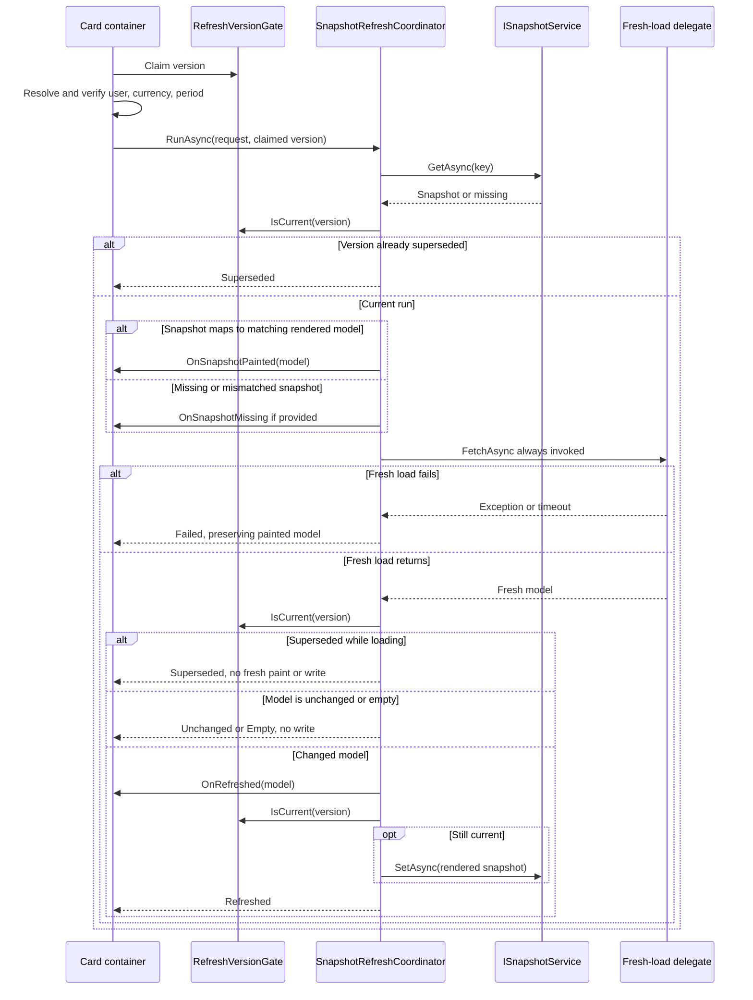
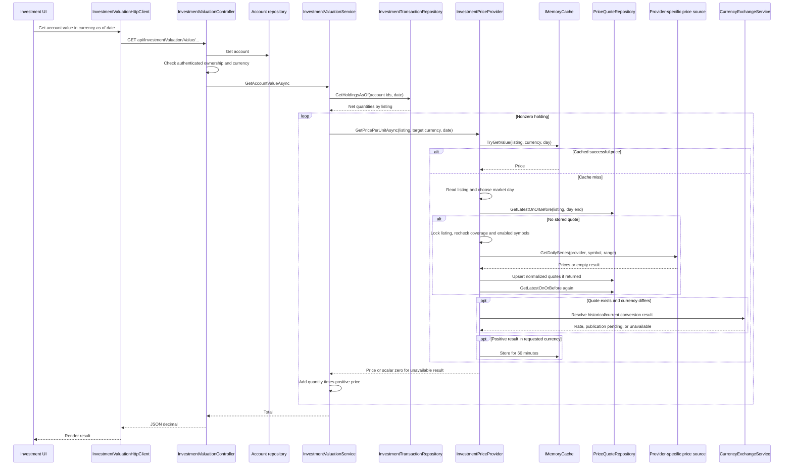
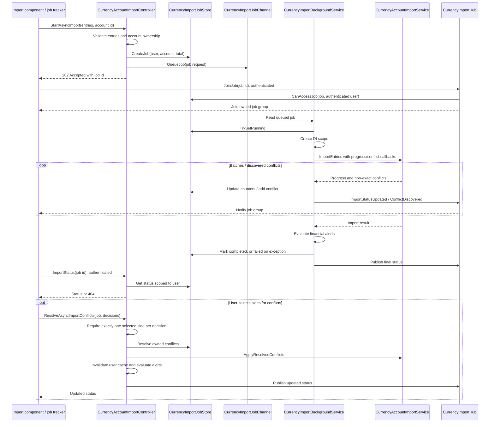
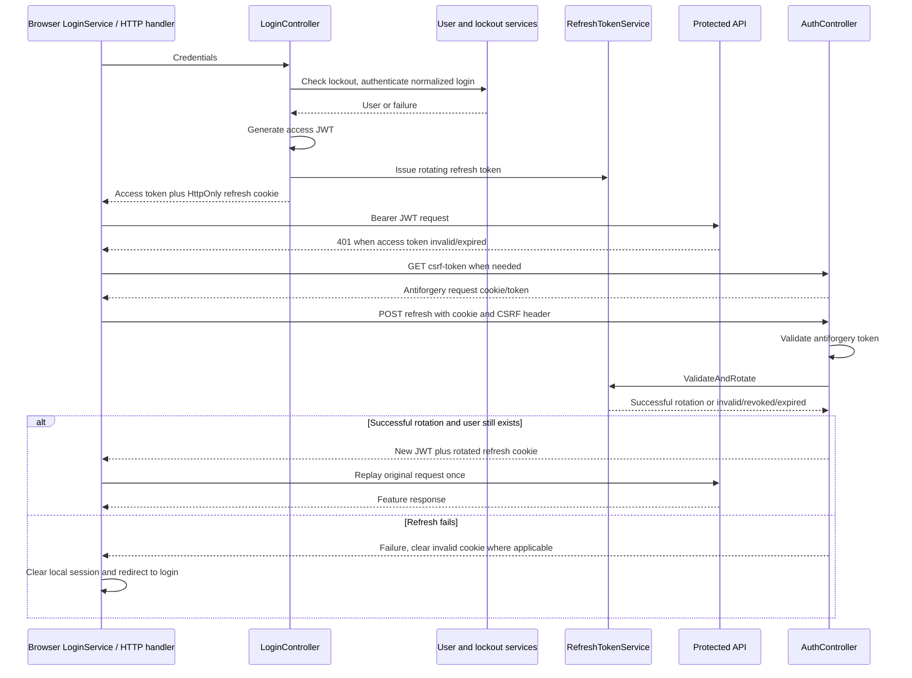
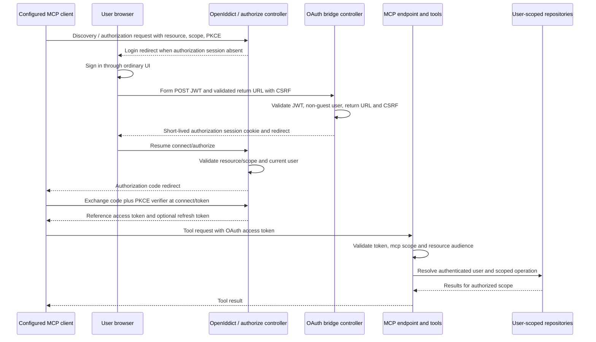

# 6. Runtime view

[Architecture index](README.md)

These sequences trace representative implementations. They omit framework internals and describe code paths, not measured latency or production execution. Feature request processing normally follows component → typed HTTP client → authenticated controller → application service/repository; some endpoints use repository contracts directly.

## 6.1 Rendered snapshot refresh

Example surface: [PortfolioReturnAttributionCardContainer](../../code/FinanceManager.Components/Features/Dashboard/Components/Cards/Assets/PortfolioReturnAttributionCardContainer.razor.cs). It resolves user/currency/period context, claims a refresh version, and delegates rendered-state reuse to [SnapshotRefreshCoordinator](../../code/FinanceManager.Components/Shared/Services/SnapshotRefreshCoordinator.cs).

Context validation belongs to the caller's `ToModel`, not to a global TTL. The example checks user id, currency id, start date, and end day before accepting a model. Every run that reaches the load stage invokes its fresh delegate, including a usable snapshot hit. That delegate must actually fetch fresh data; passing through a separate TTL cache would defeat the intended freshness rule.

Read failures fall through to fresh loading: unreadable snapshots are evicted best-effort, canceled reads are not evicted. A failed load retains the painted model and reports a blocking failure only when no useful model exists. Equal rendered content does not repaint or rewrite merely because timestamp metadata changed. Persistence failure is logged after the fresh model is rendered; it does not undo the paint. The coordinator's version checks prevent older loads from replacing the current run's model/snapshot. Details and surface-specific interactive-state rules are in [UI snapshots](concepts/ui-snapshots.md).

## 6.2 Investment account valuation and price retrieval

The current model uses asset listings and price quotes. It replaces the old documentation's `StockPriceHttpClient → StockPriceController → StockPriceProvider → StockPriceRepository` chain, whose cited paths no longer exist.

Evidence: [typed client](../../code/FinanceManager.Components/Features/FinancialAccounts/HttpClients/InvestmentValuationHttpClient.cs), [controller](../../code/FinanceManager.Api/Features/FinancialAccounts/Investments/Controllers/InvestmentValuationController.cs), [valuation](../../code/FinanceManager.Application/FinancialAccounts/Investments/Valuation/InvestmentValuationService.cs), [price provider](../../code/FinanceManager.Application/Assets/Pricing/InvestmentPriceProvider.cs), [quote repository](../../code/FinanceManager.Infrastructure/Features/Assets/Repositories/PriceQuoteRepository.cs).

Important branches:

- The controller returns missing-account/currency and forbidden-owner responses before valuation. Date-range endpoints reject reversed ranges.
- Price cache hits avoid repository reads. Stored quotes use latest-on-or-before semantics, and weekends map to a prior market day; this is not a guarantee of a newly published quote for every requested date.
- Fetching orders enabled listing symbols by provider priority and primary status, serializes per listing, and records failed/successful attempts. Recent symbol failures have a 15-minute cooldown. Registered daily sources include Alpha Vantage, Twelve Data, and EODHD; [fallback source](../../code/FinanceManager.Application/FinancialAccounts/Stock/Pricing/FallbackStockPriceSource.cs) returns empty on exhausted failures while honoring caller cancellation.
- Provider quotes are multiplied by the listing price multiplier and normalized from minor quote units such as GBX into GBP before storage. Raw price/currency and provider metadata remain in the quote.
- Typed price results can report `NotYetPublished` with a retry time. The scalar `GetPricePerUnitAsync` wrapper maps unavailable results to zero; account valuation omits nonpositive prices. A numeric total therefore can represent partial pricing rather than complete valuation.
- Historical conversion can fall back to USD when the requested FX is unavailable. Such fallback values are not cached under the requested-currency key; the remaining interpretation risk is recorded in [chapter 11](11-risks-and-technical-debt.md).
- Series valuation batches transaction reads and prices each distinct listing; EF operations stay sequential. Price-series FX retrieval is batched by currency/range with documented gap-fill behavior. See [integration details](concepts/integrations.md) and [financial concepts](08-crosscutting-concepts.md).

## 6.3 Asynchronous currency import and conflict resolution

Evidence: [controller](../../code/FinanceManager.Api/Features/FinancialAccounts/Currencies/Controllers/CurrencyAccountImportController.cs), [channel](../../code/FinanceManager.Api/Features/FinancialAccounts/Currencies/Services/CurrencyImportJobChannel.cs), [worker](../../code/FinanceManager.Api/Features/FinancialAccounts/Currencies/Services/CurrencyImportBackgroundService.cs), [job store](../../code/FinanceManager.Api/Features/FinancialAccounts/Currencies/Services/CurrencyImportJobStore.cs), [hub](../../code/FinanceManager.Api/Features/FinancialAccounts/Currencies/Hubs/CurrencyImportHub.cs), [import service](../../code/FinanceManager.Application/FinancialAccounts/Currencies/Import/CurrencyAccountImportService.cs), [browser tracker](../../code/FinanceManager.Components/Features/FinancialAccounts/Services/CurrencyImportJobTracker.cs).

The queue is bounded to 256 requests, uses one reader, and waits when full; `202` follows successful queue admission, not completed persistence. The worker publishes progress with a 200 ms throttling interval and a final update. Status polling complements events that can race group subscription. Store and queue are process-local; restart does not preserve queued jobs/status. The worker uses the host shutdown token, not the original HTTP request token. Shutdown cancellation exits processing; other exceptions mark the job failed and publish status. Import effects and job metadata have different persistence lifetimes.

Synchronous import and synchronous conflict resolution also exist. They validate account ownership, invoke the same import service, invalidate user cache, and evaluate alerts before responding. Async conflict resolution validates/store-resolves each decision before applying resolved changes, so do not assume the entire submitted list is one atomic operation. The diagram does not claim all-or-nothing admission or transactional processing of a whole import.

## 6.4 Browser login and token refresh

Evidence: [LoginController](../../code/FinanceManager.Api/Features/Identity/Controllers/LoginController.cs), [AuthController](../../code/FinanceManager.Api/Features/Identity/Controllers/AuthController.cs), [TokenRefreshRedirectHandler](../../code/FinanceManager.Components/Shared/Services/TokenRefreshRedirectHandler.cs), [LoginService](../../code/FinanceManager.Components/Features/Identity/Services/LoginService.cs), [API security](../../code/FinanceManager.Api/ApiConfigurationExtensions.cs).

Ordinary login normalizes case, checks account lockout, validates credentials, and resets lockout on success. Recording activity, queueing insights, and issuing refresh tokens are best-effort side effects: access JWT success can still occur when one fails. Guest login takes a separate sandbox path and does not issue persistent rotating refresh tokens. The handler excludes auth endpoints from automatic refresh, buffers bodies for replay, and retries only once after refresh; cookies alone do not authorize the feature API.

Refresh/logout use antiforgery validation and the rotating server-side token state. Replaying a revoked refresh token can revoke its family. The browser-side storage is session convenience rather than an ownership/security authority. The [develop login controller](../../code/FinanceManager.Api/Features/Identity/Controllers/DevelopLoginController.cs) supports `guest` and an opt-in seeded `testuser`, returns 404 in Production/Release, and returns 503 if the test account has not been seeded. Use the repository's [app usage skill](../../.claude/skills/finance-manager-usage/SKILL.md) for the `/DevelopLogin/{login}/{page}` UI route when testing.

## 6.5 OAuth-authorized MCP tool call

Evidence: [MCP registration/mapping](../../code/FinanceManager.Api/Features/Mcp/McpFeatureExtensions.cs), [security and OpenIddict setup](../../code/FinanceManager.Api/ApiConfigurationExtensions.cs), [authorize controller](../../code/FinanceManager.Api/Features/Mcp/Controllers/McpOAuthController.cs), [bridge](../../code/FinanceManager.Api/Features/Mcp/Controllers/McpOAuthBridgeController.cs), [return URL/token validation](../../code/FinanceManager.Api/Features/Mcp/OAuth/McpOAuthAuthentication.cs), [McpUserContext](../../code/FinanceManager.Api/Features/Mcp/McpUserContext.cs), [tool groups](../../code/FinanceManager.Api/Features/Mcp/Tools).

MCP uses stateless HTTP transport and tool groups for identity, financial accounts, transactions, investments, and reference data. Server instructions ask the client to call `who_am_i` before user-specific work; tool-side identity scoping is the enforceable boundary. Authorization uses reference tokens and validates persisted authorization/token entries. Ordinary browser JWTs are only used to establish the short-lived bridge session; the MCP endpoint requires its dedicated policy, `mcp` scope, and configured resource audience. The authorize controller rejects invalid resource/scopes; the bridge rejects guest identities and return URLs outside the configured authorization origin/path. PKCE plain is disabled; configured clients control PKCE requirements.

When `McpOAuth:Enabled` is false, the MCP endpoint/discovery mappings return 404 and authorization/bridge actions are disabled. The committed Production overlay sets it false; enabling it requires valid clients, issuer/resource URLs and production signing/encryption certificates. Configuration does not establish that a production rollout has occurred. [MCP tests](../../code/FinanceManager.Tests.Integration/Features/Mcp) cover selected endpoint/security behavior; [integrations](concepts/integrations.md) provides configuration details.
