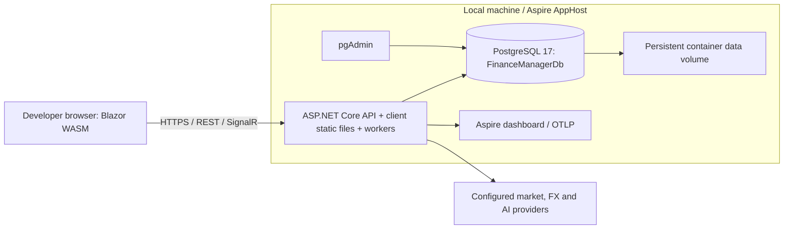
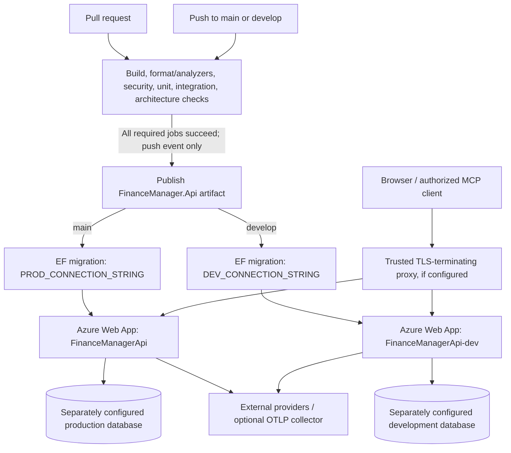

# 7. Deployment view

[Architecture index](README.md)

This view describes deployment **declared by the repository as of 2026-10-05**. It does not certify which Azure resources, database engine, proxy, certificates, secret values, health settings, or instance count are currently running. Those require operator inspection of the host. Deployment procedures and MCP certificate/revocation instructions are maintained in the [deployment runbook](operations/deployment.md).

## 7.1 Local development

[AppHost](../../code/AppHost/AppHost.cs) starts a persistent PostgreSQL 17 container with a data volume and pgAdmin, creates `FinanceManagerDb`, and starts the API after the database is ready. Aspire supplies the database connection through a resource reference. The API serves the published Blazor WebAssembly client and hosts REST endpoints, SignalR hubs, MCP when enabled, and background workers in the same process.

The standalone API is another supported startup path. Its [Development configuration](../../code/FinanceManager.Api/appsettings.Development.json) still names a machine-specific SQL Server using integrated authentication. Therefore, running the API directly is not equivalent to running AppHost. Configure an appropriate connection locally; do not infer that the checked-in host name is available on another developer's machine.

Database selection is implemented in [Infrastructure composition](../../code/FinanceManager.Infrastructure/ServiceCollectionExtension.cs):

1. `UseInMemoryDatabase=true` selects EF InMemory.
2. Relational connection precedence is `ConnectionStrings:FinanceManagerDb`, then `ConnectionStrings:DefaultConnection`, then `FINANCE_MANAGER_DB_KEY`.
3. The connection string can infer PostgreSQL or SQL Server; otherwise `DatabaseProvider` selects the engine. PostgreSQL and `Supabase` both use Npgsql. The production settings declare PostgreSQL; the fallback provider default is SQL Server.
4. Guest sandbox mode uses a request-specific InMemory store for guests and the relational store for regular users. This disables context pooling; normal relational mode uses a context pool.

This is dual-provider support in code, not proof that every migration or SQL query is exercised against both engines. The [migration guide](operations/migrations.md) and [database recovery runbook](operations/database-recovery.md) cover operational steps and recovery limits.

## 7.2 Hosted deployment and branch mapping

The [CI workflow](../../.github/workflows/ci.yml) defines two Azure App Service targets and publishes the API project, including the hosted WASM assets, as one artifact.

| Source branch | GitHub environment | Declared Azure Web App | Database migration secret | Deployment credential secret |
| --- | --- | --- | --- | --- |
| `main` | `production` | `FinanceManagerApi` | `PROD_CONNECTION_STRING` | `AZURE_WEBAPP_PUBLISH_PROFILE` |
| `develop` | `development` | `FinanceManagerApi-dev` | `DEV_CONNECTION_STRING` | `AZURE_WEBAPP_PUBLISH_PROFILE_DEV` |

Pull requests run checks but do not deploy. A qualifying push first passes the six validation jobs, then publishes; the branch-specific deploy job applies migrations before deploying the artifact. The architecture job uses Debug because its dependency checks inspect compiled IL. Environment-specific database separation is an operator requirement; the two secret names alone do not prove the databases differ.

The `development` GitHub environment identifies the deployment destination. It does **not** automatically set `ASPNETCORE_ENVIRONMENT=Development`; the runbook recommends hosted settings independent of local Development configuration. The workflow comments describe F1 constraints and recommend `WEBSITE_RUN_FROM_PACKAGE=1`, but the workflow does not set this host setting. Its actual value, Azure tier, operating system/RID, preview-slot availability, capacity and sleep behavior must be verified on the deployed resource. Feature-branch previews remain unimplemented in the repository's deployment design.

## 7.3 Runtime configuration and security prerequisites

[API configuration](../../code/FinanceManager.Api/ApiConfigurationExtensions.cs) fails startup outside Development when the JWT key, allowed CORS origins, or trusted proxy addresses/networks are missing. The proxy must preserve the public scheme and original client address; [Program](../../code/FinanceManager.Api/Program.cs) applies forwarded headers before scheme/IP-sensitive middleware. A code comment mentions Cloudflare, but this is not verification of live proxy topology.

For enabled MCP OAuth, hosted environments additionally require a consistent public HTTPS issuer/resource/login URL, registered redirect URIs, and persistent signing/encryption certificates. Local Development uses development certificates; Test uses ephemeral keys. Follow the runbook's reconnect/revocation procedure when rotating certificates: the current configuration exposes one active certificate pair and does not promise seamless rotation.

Secrets belong in User Secrets or the host's secret/configuration store. Supply provider credentials and connection strings separately for each environment. `OTEL_EXPORTER_OTLP_ENDPOINT` activates telemetry export; without it, collected traces/metrics are not exported. Production settings provide configuration intent, not evidence that a collector is connected.

## 7.4 Probes, release and recovery boundaries

| Endpoint | Meaning | Access | Hosting interpretation |
| --- | --- | --- | --- |
| `/alive` | Self/liveness check only | Anonymous aggregate status | Process responsiveness; dependency failures should not trigger restart loops |
| `/health` | Readiness including database connectivity | Anonymous aggregate status | Traffic eligibility, subject to the host's health behavior |
| `/health/detail` | Per-check operational detail | Admin authorization | Operator diagnosis; not a public topology endpoint |

[ServiceDefaults](../../code/ServiceDefaults/Extensions.cs) implements these probes and [API health registration](../../code/FinanceManager.Api/ServiceCollectionExtension.cs) includes the database check. The runbook distinguishes Azure's health behavior from an orchestrator with separate liveness/readiness controls.

A migration succeeds or fails independently of artifact deployment. Rolling back the application artifact does not undo a schema or data migration. Before schema changes, identify a recoverable backup, compatible prior artifact, and restore procedure; use the [recovery runbook](operations/database-recovery.md). This documentation establishes no measured recovery-time objective or recovery-point objective; proposed quality scenarios and unresolved host checks are in [section 10](10-quality-requirements.md) and [section 11](11-risks-and-technical-debt.md).
